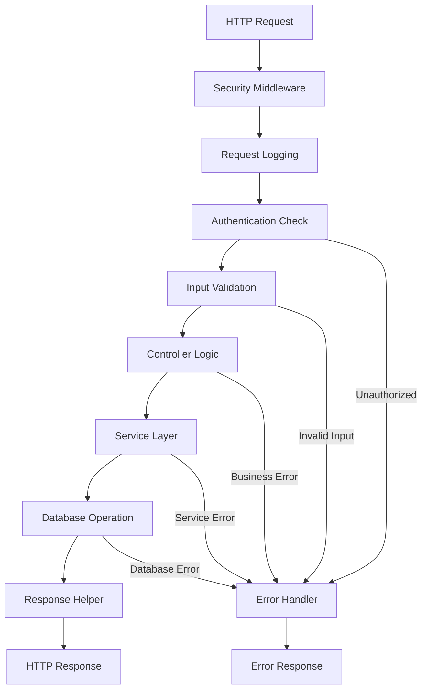
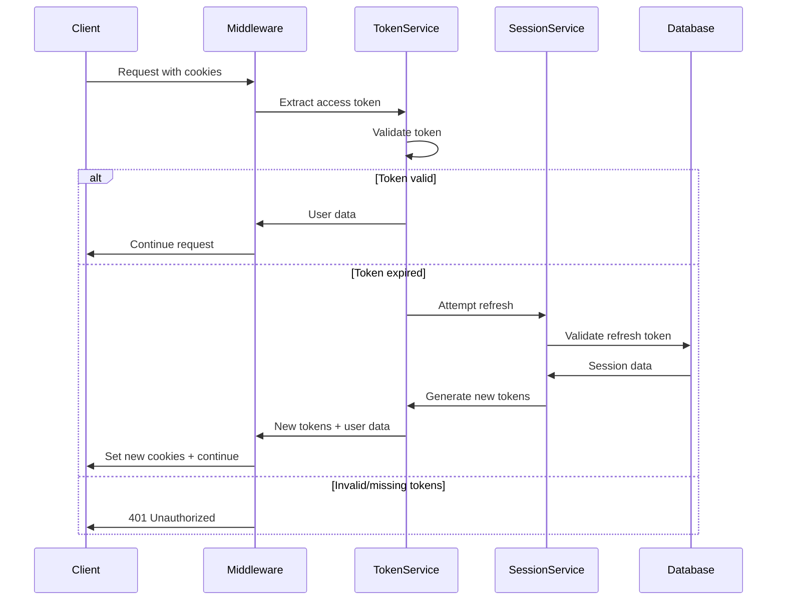

# 🏗️ Project Architecture

Complete architectural overview of the Express TypeScript Starter project, including design patterns, technology stack, and system organization.

## 📋 Table of Contents

- [Overview](#overview)
- [Technology Stack](#technology-stack)
- [Architecture Patterns](#architecture-patterns)
- [Directory Structure](#directory-structure)
- [Data Flow](#data-flow)
- [Security Architecture](#security-architecture)
- [Testing Architecture](#testing-architecture)
- [Performance Considerations](#performance-considerations)

## Overview

The Express TypeScript Starter follows **Clean Architecture** principles with strict separation of concerns and dependency inversion. The project is designed for enterprise-grade applications with comprehensive testing, security, and maintainability.

### Core Principles

- **Clean Architecture** - Clear separation between layers
- **SOLID Principles** - Object-oriented design best practices
- **Test-Driven Development** - Comprehensive testing at all layers
- **Security First** - Built-in security measures and best practices
- **TypeScript Strict** - Full type safety and compile-time checks

## Technology Stack

### Core Framework

```
Express.js 5.1 + TypeScript 5.9
├── Node.js 18+ runtime
├── Strict TypeScript configuration
└── ES2022 target compilation
```

### Database Layer

```
MongoDB 8.17 + Mongoose ODM
├── Schema validation with TypeScript interfaces
├── Optimized indexes for performance
├── Connection pooling and error handling
└── Transaction support for critical operations
```

### Authentication & Security

```
JWT Authentication + bcryptjs
├── HTTP-only cookie storage
├── Access + Refresh token pattern
├── Helmet.js security headers
├── CORS configuration per environment
├── Rate limiting (100 req/15min)
└── Input validation with Zod v4+
```

### Testing Framework

```
Jest 30 + Supertest
├── 249 tests across 17 test suites (100% pass rate)
├── 100% test success rate
├── TestHelper utilities for mocking
├── Integration and unit test coverage
└── CI/CD automated testing
```

### Development Tools

```
ESLint + Prettier + Husky
├── Strict TypeScript rules
├── Automatic code formatting
├── Pre-commit hooks for quality
├── Import organization with barrel exports
└── Zero-tolerance error policy
```

## Architecture Patterns

### 1. Controller-Service Pattern

Controllers handle HTTP requests and delegate business logic to services:

```typescript
/**
 * Controller Layer - HTTP handling only
 */
export class AuthController {
  private userService: UserService;

  public register = asyncHandler(async (req: Request, res: Response) => {
    const userData: ICreateUserDto = req.body;

    // Delegate to service layer
    const user = await this.userService.createUser(userData);

    // Use helper for consistent responses
    ResponseHelper.sendCreated(res, user, 'User created successfully');
  });
}

/**
 * Service Layer - Business logic implementation
 */
export class UserService {
  async createUser(userData: ICreateUserDto): Promise<IUser> {
    // Business validation
    const existingUser = await this.findUserByIdentifier(userData.email);
    if (existingUser) {
      throw new ConflictError('User already exists');
    }

    // Password hashing with helper
    const hashedPassword = await UserHelper.hashPassword(userData.password);

    // Database interaction
    return await User.create({
      ...userData,
      password: hashedPassword,
    });
  }
}
```

### 2. Middleware Pipeline Pattern

Middleware components handle cross-cutting concerns:

```typescript
/**
 * Middleware Pipeline for Protected Routes
 */
router.post(
  '/protected-endpoint',
  authenticate, // 1. Authentication
  validateRequest(schema), // 2. Input validation
  auditLogger, // 3. Action logging
  controller.method // 4. Controller logic
);

/**
 * Authentication Middleware
 */
export const authenticate = asyncHandler(
  async (req: Request, res: Response, next: NextFunction) => {
    const token = TokenService.extractAccessToken(req);
    const user = await TokenService.validateAccessToken(token);

    req.user = user;
    req.logger = logger.child({ userId: user._id });
    next();
  }
);
```

### 3. Repository Pattern (via Mongoose)

Data access abstraction through Mongoose models:

```typescript
/**
 * Model with business methods
 */
export const User = mongoose.model<IUserDocument>('User', userSchema);

userSchema.methods.comparePassword = async function (
  password: string
): Promise<boolean> {
  return bcrypt.compare(password, this.password);
};

userSchema.methods.sanitize = function (): IUserResponse {
  return UserHelper.sanitizeUser(this.toObject());
};
```

## Directory Structure

### Source Code Organization

```
src/
├── controllers/         # HTTP request handlers (4 controllers)
│   ├── auth.controller.ts      # Authentication endpoints
│   ├── user.controller.ts      # User management (admin)
│   ├── profile.controller.ts   # Profile management
│   ├── admin.controller.ts     # Administrative operations
│   └── index.ts               # Barrel exports
├── services/           # Business logic layer (6 services)
│   ├── user.service.ts        # User operations
│   ├── session.service.ts     # Session management
│   ├── token.service.ts       # JWT operations
│   ├── avatar.service.ts      # Avatar upload/management
│   ├── email.service.ts       # Email operations
│   ├── cleanup.service.ts     # System cleanup tasks
│   └── index.ts              # Barrel exports
├── models/             # Database schemas (3 models)
│   ├── user.model.ts         # User schema & methods
│   ├── session.model.ts      # Session tracking
│   ├── profile.model.ts      # Extended user profiles
│   └── index.ts             # Barrel exports
├── middleware/         # Express middleware (8 components)
│   ├── auth.middleware.ts         # JWT authentication
│   ├── security.middleware.ts     # Security headers & CORS
│   ├── audit.middleware.ts        # Action logging
│   ├── validate-request.ts        # Input validation
│   ├── error-handler.ts          # Global error handling
│   ├── async-handler.ts          # Promise error wrapper
│   ├── context.middleware.ts     # Request context enhancement
│   ├── performance.middleware.ts # Performance monitoring
│   └── index.ts                 # Barrel exports
├── routes/             # Route definitions
│   ├── auth.routes.ts        # Authentication routes
│   ├── user.routes.ts        # User management routes
│   ├── profile.routes.ts     # Profile management routes
│   ├── admin.routes.ts       # Admin routes
│   └── index.ts             # Route aggregation
├── schemas/            # Zod validation schemas
│   ├── auth/                # Authentication schemas
│   ├── user/               # User management schemas
│   ├── profile/            # Profile schemas
│   └── email/              # Email schemas
├── interfaces/         # TypeScript type definitions
│   ├── user.interface.ts   # User-related types
│   ├── auth.interface.ts   # Authentication types
│   ├── email.interface.ts  # Email types
│   └── index.ts           # Barrel exports
├── utils/              # Helper functions
│   ├── response.helper.ts  # API response standardization
│   ├── date.helper.ts      # Date operations
│   ├── user.helper.ts      # User operations
│   ├── error.helper.ts     # Error handling utilities
│   ├── email.helper.ts     # Email utilities
│   └── index.ts           # Barrel exports
├── config/             # Configuration management
│   ├── env.ts             # Environment variables
│   ├── logger.ts          # Winston configuration
│   ├── database.ts        # MongoDB connection
│   └── index.ts          # Barrel exports
├── i18n/               # Internationalization
│   ├── index.ts          # i18n configuration
│   └── locales/         # Language files
│       ├── en.ts        # English translations
│       └── fr.ts        # French translations
└── __tests__/          # Test suites (17 test suites, 249 tests with 100% pass rate)
    ├── controllers/     # Controller tests (4 suites)
    ├── services/        # Service tests (6 suites)
    ├── middleware/      # Middleware tests (7 suites)
    ├── utils/          # Utility tests (1 suite)
    ├── helpers/        # Test utilities
    └── setup/          # Test configuration
```

### Key Architectural Decisions

#### 1. Barrel Exports

**Every folder has an `index.ts` for clean imports:**

```typescript
// Instead of: import { AuthController } from './auth.controller';
// Use: import { AuthController } from '../controllers';
```

#### 2. Helper Utilities

**Mandatory usage of project helpers:**

```typescript
// ResponseHelper for all API responses
ResponseHelper.sendSuccess(res, data, 200, 'Success message');

// DateHelper for all date operations
const expirationDate = DateHelper.addDays(new Date(), 7);

// UserHelper for user operations
const sanitizedUser = UserHelper.sanitizeUser(user);
```

#### 3. Contextual Logging

**All controllers use contextual logging:**

```typescript
export const someMethod = asyncHandler(async (req: Request, res: Response) => {
  const contextLogger = req.logger ?? logger;

  contextLogger.info('Operation started', {
    userId: req.user?._id,
    operation: 'someOperation',
    requestId: ResponseHelper.extractRequestId(req),
  });
});
```

## Data Flow

### 1. Request Processing Pipeline



### 2. Authentication Flow



## Security Architecture

### 1. Authentication Security

- **JWT Tokens in HTTP-only cookies** - Prevent XSS attacks
- **Access + Refresh token pattern** - Short-lived access tokens
- **Session tracking** - Monitor user sessions across devices
- **Automatic token rotation** - Enhanced security through rotation

### 2. Input Validation

- **Zod v4+ validation** - Runtime type checking
- **Schema-based validation** - Consistent validation patterns
- **Error handling** - Detailed validation error responses
- **Sanitization** - Input cleaning and normalization

### 3. Security Headers

```typescript
// Helmet.js configuration
app.use(
  helmet({
    contentSecurityPolicy: {
      directives: {
        defaultSrc: ["'self'"],
        styleSrc: ["'self'", "'unsafe-inline'"],
        scriptSrc: ["'self'"],
        imgSrc: ["'self'", 'data:', 'https:'],
      },
    },
    hsts: {
      maxAge: 31536000,
      includeSubDomains: true,
      preload: true,
    },
  })
);
```

### 4. Rate Limiting

```typescript
// Rate limiting configuration
const limiter = rateLimit({
  windowMs: 15 * 60 * 1000, // 15 minutes
  max: 100, // limit each IP to 100 requests per windowMs
  message: 'Too many requests from this IP',
  standardHeaders: true,
  legacyHeaders: false,
});
```

## Testing Architecture

### 1. Test Organization

```
__tests__/
├── controllers/    # API endpoint testing (4 suites)
├── services/       # Business logic testing (6 suites)
├── middleware/     # Middleware testing (7 suites)
├── utils/          # Utility testing (1 suite)
├── helpers/        # Test utilities and mocks
└── setup/          # Test configuration and setup
```

### 2. Test Statistics

- **Total Tests**: 249 tests across 17 test suites (100% success rate)
- **Coverage**: 54.9% overall coverage focused on critical business logic
  - Controllers: 55.17% coverage
  - Services: 59.44% coverage
  - Middleware: 65.24% coverage
  - Utils: 48.36% coverage
- **Success Rate**: 100% (17/17 suites passing)
- **Coverage Areas**: Controllers, Services, Middleware, Utils
- **Test Types**: Unit tests, Integration tests, API tests

### 3. TestHelper System

```typescript
import { TestHelper } from '../helpers';

describe('Controller Tests', () => {
  it('should handle request properly', async () => {
    // Mock Express context
    const { req, res, next } = TestHelper.createMockContext();

    // Mock user data
    const mockUser = TestHelper.generateMockUser({ role: 'admin' });

    // Test database operations
    await TestHelper.clearDatabase();
    await TestHelper.seedTestData();
  });
});
```

## Performance Considerations

### 1. Database Optimization

- **Proper Indexing** - Optimized queries on frequent searches
- **Connection Pooling** - Efficient database connections
- **Query Optimization** - Lean queries with specific field selection
- **Aggregation Pipelines** - Complex operations at database level

### 2. Caching Strategy

- **Response Caching** - Cache frequently requested data
- **Session Caching** - In-memory session storage for performance
- **Static Asset Caching** - Proper cache headers for static content

### 3. Memory Management

- **Garbage Collection** - Proper cleanup of resources
- **Memory Leaks Prevention** - Event listener cleanup
- **Streaming for Large Data** - Handle large file uploads efficiently

### 4. Monitoring & Metrics

- **Request Timing** - Monitor API response times
- **Error Tracking** - Comprehensive error logging
- **Health Checks** - System status monitoring
- **Performance Metrics** - Track key performance indicators

---

This architecture provides a solid foundation for scalable, maintainable, and secure applications while maintaining high code quality and comprehensive testing coverage.
