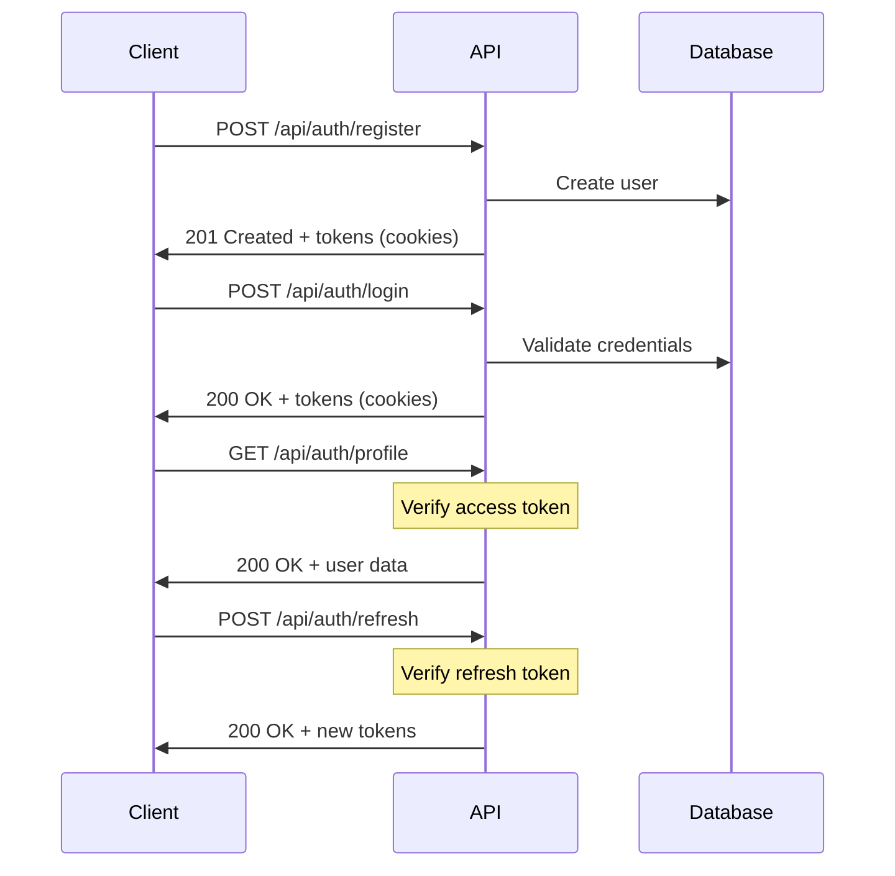

# 🔌 API Documentation

Complete reference for all API endpoints in the **Express TypeScript Starter**.

## 📖 Overview

**Base URL**: `http://localhost:3000` (development)

**API Version**: `v1` (automatically applied)

**Content Type**: `application/json`

**Authentication**: JWT tokens via HTTP-only cookies

## 🔐 Authentication

The API uses **JWT-based authentication** with two types of tokens:

- **Access Token** - Short-lived (15 minutes) for API access
- **Refresh Token** - Long-lived (7 days) for token renewal

Tokens are stored in **HTTP-only cookies** for security.

### Authentication Flow



---

## 🔐 Authentication Endpoints

### Register User

Create a new user account.

**`POST /api/auth/register`**

#### Request Body

```json
{
  "username": "johndoe",
  "email": "john@example.com",
  "password": "securePassword123"
}
```

#### Request Validation

- `username`: 3-30 characters, alphanumeric + underscore
- `email`: Valid email format
- `password`: Minimum 8 characters

#### Success Response

```http
HTTP/1.1 201 Created
Content-Type: application/json
Set-Cookie: access_token=...; HttpOnly; Secure; SameSite=Strict
Set-Cookie: refresh_token=...; HttpOnly; Secure; SameSite=Strict

{
  "success": true,
  "message": "User created successfully",
  "data": {
    "id": "64a1b2c3d4e5f6789abcdef0",
    "username": "johndoe",
    "email": "john@example.com",
    "role": "user",
    "isActive": true,
    "isEmailVerified": false,
    "createdAt": "2024-01-01T12:00:00.000Z",
    "updatedAt": "2024-01-01T12:00:00.000Z"
  },
  "requestId": "req_123456789"
}
```

#### Error Responses

```json
// 409 Conflict - User already exists
{
  "success": false,
  "error": {
    "message": "Email already exists",
    "code": "CONFLICT"
  },
  "requestId": "req_123456789"
}

// 400 Bad Request - Validation error
{
  "success": false,
  "error": {
    "message": "Validation failed",
    "code": "VALIDATION_ERROR",
    "details": [
      {
        "field": "password",
        "message": "Password must be at least 8 characters"
      }
    ]
  },
  "requestId": "req_123456789"
}
```

### Login User

Authenticate user with credentials.

**`POST /api/auth/login`**

#### Request Body

```json
{
  "identifier": "john@example.com", // email or username
  "password": "securePassword123"
}
```

#### Success Response

```http
HTTP/1.1 200 OK
Content-Type: application/json
Set-Cookie: access_token=...; HttpOnly; Secure; SameSite=Strict
Set-Cookie: refresh_token=...; HttpOnly; Secure; SameSite=Strict

{
  "success": true,
  "message": "Login successful",
  "data": {
    "user": {
      "id": "64a1b2c3d4e5f6789abcdef0",
      "username": "johndoe",
      "email": "john@example.com",
      "role": "user",
      "isActive": true,
      "isEmailVerified": false,
      "lastLogin": "2024-01-01T12:00:00.000Z",
      "createdAt": "2024-01-01T12:00:00.000Z",
      "updatedAt": "2024-01-01T12:00:00.000Z"
    },
    "sessionId": "64a1b2c3d4e5f6789abcdef1"
  },
  "requestId": "req_123456789"
}
```

#### Error Responses

```json
// 401 Unauthorized - Invalid credentials
{
  "success": false,
  "error": {
    "message": "Invalid credentials",
    "code": "UNAUTHORIZED"
  },
  "requestId": "req_123456789"
}

// 429 Too Many Requests - Account locked
{
  "success": false,
  "error": {
    "message": "Account locked due to too many failed attempts",
    "code": "ACCOUNT_LOCKED"
  },
  "retryAfter": 900,
  "requestId": "req_123456789"
}
```

### Get User Profile

Get current user's profile information.

**`GET /api/auth/profile`**

**Requires Authentication**: ✅

#### Success Response

```json
{
  "success": true,
  "message": "Profile retrieved successfully",
  "data": {
    "id": "64a1b2c3d4e5f6789abcdef0",
    "username": "johndoe",
    "email": "john@example.com",
    "role": "user",
    "isActive": true,
    "isEmailVerified": false,
    "lastLogin": "2024-01-01T12:00:00.000Z",
    "createdAt": "2024-01-01T12:00:00.000Z",
    "updatedAt": "2024-01-01T12:00:00.000Z"
  },
  "requestId": "req_123456789"
}
```

### Refresh Token

Refresh access token using refresh token.

**`POST /api/auth/refresh`**

**Note**: Uses refresh token from HTTP-only cookie

#### Success Response

```http
HTTP/1.1 200 OK
Content-Type: application/json
Set-Cookie: access_token=...; HttpOnly; Secure; SameSite=Strict
Set-Cookie: refresh_token=...; HttpOnly; Secure; SameSite=Strict

{
  "success": true,
  "message": "Token refreshed successfully",
  "data": {
    "user": {
      "id": "64a1b2c3d4e5f6789abcdef0",
      "username": "johndoe",
      "email": "john@example.com",
      "role": "user",
      "isActive": true,
      "isEmailVerified": false,
      "lastLogin": "2024-01-01T12:00:00.000Z",
      "createdAt": "2024-01-01T12:00:00.000Z",
      "updatedAt": "2024-01-01T12:00:00.000Z"
    }
  },
  "requestId": "req_123456789"
}
```

### Logout User

Logout current session.

**`POST /api/auth/logout`**

**Requires Authentication**: ✅

#### Success Response

```http
HTTP/1.1 200 OK
Content-Type: application/json
Set-Cookie: access_token=; HttpOnly; Secure; SameSite=Strict; Max-Age=0
Set-Cookie: refresh_token=; HttpOnly; Secure; SameSite=Strict; Max-Age=0

{
  "success": true,
  "message": "Logout successful",
  "data": null,
  "requestId": "req_123456789"
}
```

### Logout All Devices

Logout from all active sessions.

**`POST /api/auth/logout-all`**

**Requires Authentication**: ✅

#### Success Response

```json
{
  "success": true,
  "message": "Logged out from all devices successfully",
  "data": null,
  "requestId": "req_123456789"
}
```

### Get Active Sessions

Get list of user's active sessions.

**`GET /api/auth/sessions`**

**Requires Authentication**: ✅

#### Success Response

```json
{
  "success": true,
  "message": "Sessions retrieved successfully",
  "data": [
    {
      "id": "64a1b2c3d4e5f6789abcdef1",
      "deviceInfo": {
        "userAgent": "Mozilla/5.0 (Windows NT 10.0; Win64; x64) AppleWebKit/537.36",
        "platform": "Web",
        "browser": "Chrome"
      },
      "location": {
        "country": "US",
        "city": "New York",
        "timezone": "America/New_York"
      },
      "ipAddress": "192.168.1.100",
      "lastActivity": "2024-01-01T12:00:00.000Z",
      "createdAt": "2024-01-01T11:00:00.000Z",
      "isCurrent": true
    }
  ],
  "requestId": "req_123456789"
}
```

---

## 👥 User Management Endpoints

### Get User by ID

Get user information by ID.

**`GET /api/users/:id`**

**Requires Authentication**: ✅

#### Success Response

```json
{
  "success": true,
  "message": "User retrieved successfully",
  "data": {
    "id": "64a1b2c3d4e5f6789abcdef0",
    "username": "johndoe",
    "email": "john@example.com",
    "role": "user",
    "isActive": true,
    "isEmailVerified": false,
    "createdAt": "2024-01-01T12:00:00.000Z",
    "updatedAt": "2024-01-01T12:00:00.000Z"
  },
  "requestId": "req_123456789"
}
```

---

## 🏥 System Endpoints

### Health Check

Check API health and status.

**`GET /health`**

#### Success Response

```json
{
  "status": "OK",
  "timestamp": "2024-01-01T12:00:00.000Z",
  "environment": "development",
  "uptime": 3600.123,
  "service": "Express TypeScript API"
}
```

### API Information

Get API information and available endpoints.

**`GET /`**

#### Success Response

```json
{
  "success": true,
  "message": "Welcome to Express TypeScript API",
  "data": {
    "service": "Express TypeScript API",
    "version": "1.0.0",
    "endpoints": {
      "auth": "/api/auth",
      "users": "/api/users",
      "health": "/health"
    }
  }
}
```

---

## 🔧 Request/Response Format

### Standard Response Format

All API responses follow this consistent format:

```json
{
  "success": true | false,
  "message": "Human readable message",
  "data": {} | [] | null,
  "error": {  // Only present on errors
    "message": "Error message",
    "code": "ERROR_CODE",
    "details": []  // Optional validation details
  },
  "requestId": "unique-request-id"
}
```

### HTTP Status Codes

| Code  | Meaning               | Usage                                 |
| ----- | --------------------- | ------------------------------------- |
| `200` | OK                    | Successful GET, PUT, DELETE           |
| `201` | Created               | Successful POST (resource created)    |
| `400` | Bad Request           | Invalid request data/validation error |
| `401` | Unauthorized          | Authentication required/invalid       |
| `403` | Forbidden             | Access denied                         |
| `404` | Not Found             | Resource not found                    |
| `409` | Conflict              | Resource already exists               |
| `429` | Too Many Requests     | Rate limit exceeded                   |
| `500` | Internal Server Error | Server error                          |

### Error Response Examples

```json
// Validation Error (400)
{
  "success": false,
  "error": {
    "message": "Validation failed",
    "code": "VALIDATION_ERROR",
    "details": [
      {
        "field": "email",
        "message": "Invalid email format"
      }
    ]
  },
  "requestId": "req_123456789"
}

// Unauthorized (401)
{
  "success": false,
  "error": {
    "message": "Authentication required",
    "code": "UNAUTHORIZED"
  },
  "requestId": "req_123456789"
}

// Rate Limited (429)
{
  "success": false,
  "error": {
    "message": "Too many requests from this IP",
    "code": "RATE_LIMIT_EXCEEDED"
  },
  "retryAfter": 900,
  "requestId": "req_123456789"
}
```

---

## 🛡️ Security Features

### Rate Limiting

- **Global**: 100 requests per 15 minutes per IP
- **Authentication endpoints**: Additional protection for login attempts

### CORS Configuration

**Development**:

- `http://localhost:3000`
- `http://localhost:3001`

**Production**:

- Configured per environment

### Request Validation

All endpoints validate:

- **Content-Type**: Must be `application/json`
- **Request size**: Maximum 10MB
- **Schema validation**: Using Zod schemas

### Security Headers

- **Helmet.js**: Security headers
- **CSP**: Content Security Policy
- **HSTS**: HTTP Strict Transport Security

---

## 🧪 Testing Examples

### Using cURL

```bash
# Register new user
curl -X POST http://localhost:3000/api/auth/register \
  -H "Content-Type: application/json" \
  -d '{
    "username": "johndoe",
    "email": "john@example.com",
    "password": "securePassword123"
  }'

# Login user
curl -X POST http://localhost:3000/api/auth/login \
  -H "Content-Type: application/json" \
  -c cookies.txt \
  -d '{
    "identifier": "john@example.com",
    "password": "securePassword123"
  }'

# Get profile (with cookies)
curl -X GET http://localhost:3000/api/auth/profile \
  -H "Content-Type: application/json" \
  -b cookies.txt
```

### Using JavaScript/Fetch

```javascript
// Register user
const registerResponse = await fetch('/api/auth/register', {
  method: 'POST',
  headers: {
    'Content-Type': 'application/json',
  },
  credentials: 'include', // Important for cookies
  body: JSON.stringify({
    username: 'johndoe',
    email: 'john@example.com',
    password: 'securePassword123',
  }),
});

const registerData = await registerResponse.json();
console.log(registerData);

// Login user
const loginResponse = await fetch('/api/auth/login', {
  method: 'POST',
  headers: {
    'Content-Type': 'application/json',
  },
  credentials: 'include', // Important for cookies
  body: JSON.stringify({
    identifier: 'john@example.com',
    password: 'securePassword123',
  }),
});

const loginData = await loginResponse.json();
console.log(loginData);

// Get profile (cookies sent automatically)
const profileResponse = await fetch('/api/auth/profile', {
  method: 'GET',
  headers: {
    'Content-Type': 'application/json',
  },
  credentials: 'include', // Important for cookies
});

const profileData = await profileResponse.json();
console.log(profileData);
```

---

## 🌍 Internationalization

The API supports multiple languages via the `Accept-Language` header:

```bash
# English (default)
curl -H "Accept-Language: en" http://localhost:3000/api/auth/profile

# French
curl -H "Accept-Language: fr" http://localhost:3000/api/auth/profile
```

**Supported Languages**: `en`, `fr`

---

## ❓ Common Issues

### Cookies Not Working

**Problem**: Tokens not being set/sent
**Solutions**:

- Ensure `credentials: 'include'` in fetch requests
- Use `-c` and `-b` flags with cURL
- Check CORS configuration for your domain

### Token Expired

**Problem**: 401 errors on authenticated endpoints
**Solution**:

```javascript
// Refresh token automatically
const response = await fetch('/api/auth/refresh', {
  method: 'POST',
  credentials: 'include',
});
```

### Rate Limited

**Problem**: 429 Too Many Requests
**Solution**: Wait for the retry period or reduce request frequency

---

**Need help?** Check our [Development Guide](./DEVELOPMENT.md) or [open an issue](https://github.com/shuntps/express-typescript-starter/issues).

Happy coding! 🚀
